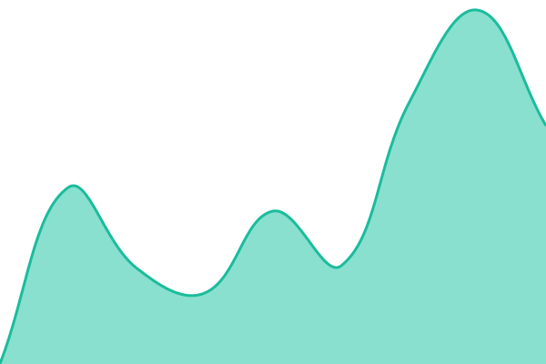
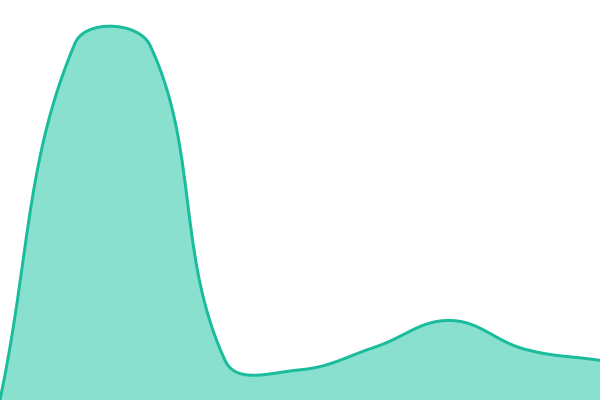
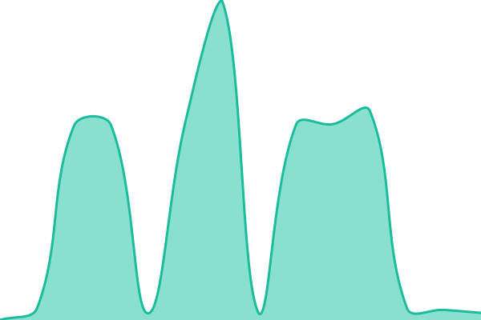
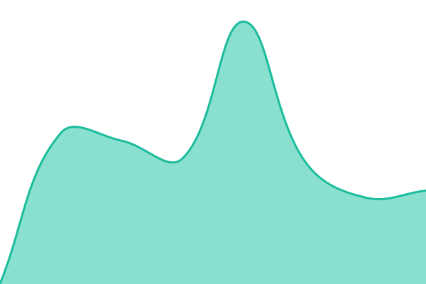
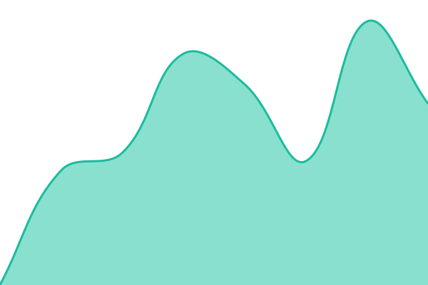
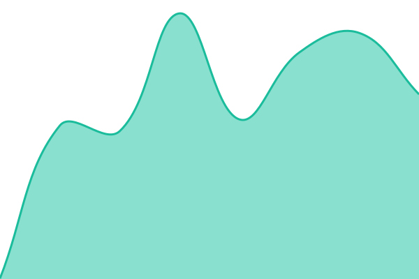
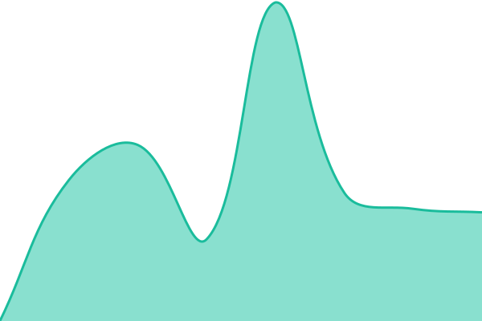

<!--start: status pages-->
<!-- This summary is generated by Upptime (https://github.com/upptime/upptime) -->
<!-- Do not edit this manually, your changes will be overwritten -->
<!-- prettier-ignore -->
| URL | Status | History | Response Time | Uptime |
| --- | ------ | ------- | ------------- | ------ |
|  [Website](https://www.bts-crew.com/) | 🟩 Up | [website.yml](https://github.com/Aspect102/bts-status/commits/HEAD/history/website.yml) | 

 545ms
     
 | 

<a href="https://Aspect102.github.io/bts-status/history/website">100.00%</a>
    

|  [Wiki](https://wiki.bts-crew.com/) | 🟩 Up | [wiki.yml](https://github.com/Aspect102/bts-status/commits/HEAD/history/wiki.yml) | 

 1384ms
     
 | 

<a href="https://Aspect102.github.io/bts-status/history/wiki">100.00%</a>
    

|  [Nextcloud](https://nextcloud.bts-crew.com/) | 🟩 Up | [nextcloud.yml](https://github.com/Aspect102/bts-status/commits/HEAD/history/nextcloud.yml) | 

 2784ms
     
 | 

<a href="https://Aspect102.github.io/bts-status/history/nextcloud">100.00%</a>
    

|  [Dress Notes](https://bts-dressnotes.su.bath.ac.uk/) | 🟩 Up | [dress-notes.yml](https://github.com/Aspect102/bts-status/commits/HEAD/history/dress-notes.yml) | 

 18775ms
     
 | 

<a href="https://Aspect102.github.io/bts-status/history/dress-notes">51.07%</a>
    

|  [PAT Database](https://assets.bts-crew.com/) | 🟩 Up | [pat-database.yml](https://github.com/Aspect102/bts-status/commits/HEAD/history/pat-database.yml) | 

 548ms
     
 | 

<a href="https://Aspect102.github.io/bts-status/history/pat-database">100.00%</a>
    

|  [Internal DNS](https://dnsadmin.bts.su.bath.ac.uk/) | 🟩 Up | [internal-dns.yml](https://github.com/Aspect102/bts-status/commits/HEAD/history/internal-dns.yml) | 

 791ms
     
 | 

<a href="https://Aspect102.github.io/bts-status/history/internal-dns">100.00%</a>
    

|  [Telephone Management](https://telephony.bts-crew.com/) | 🟩 Up | [telephone-management.yml](https://github.com/Aspect102/bts-status/commits/HEAD/history/telephone-management.yml) | 

 893ms
     
 | 

<a href="https://Aspect102.github.io/bts-status/history/telephone-management">100.00%</a>
    

|  [Access Control Admin](https://auth.bts-crew.com/admin/prod/console) | 🟩 Up | [access-control-admin.yml](https://github.com/Aspect102/bts-status/commits/HEAD/history/access-control-admin.yml) | 

 753ms
     
 | 

<a href="https://Aspect102.github.io/bts-status/history/access-control-admin">100.00%</a>
    

|  [Access Control Admin (onprem)](https://bts-auth.su.bath.ac.uk/admin/bts-prod/console) | 🟩 Up | [access-control-admin-onprem.yml](https://github.com/Aspect102/bts-status/commits/HEAD/history/access-control-admin-onprem.yml) | 

 1153ms
     
 | 

<a href="https://Aspect102.github.io/bts-status/history/access-control-admin-onprem">100.00%</a>
    

|  [PC Deployment](https://pc-deployment.bts-crew.com/) | 🟥 Down | [pc-deployment.yml](https://github.com/Aspect102/bts-status/commits/HEAD/history/pc-deployment.yml) | 

 437ms
     
 | 

<a href="https://Aspect102.github.io/bts-status/history/pc-deployment">0.00%</a>
    

|  [Virtual Machine Console](https://incus-admin.su.bath.ac.uk/) | 🟩 Up | [virtual-machine-console.yml](https://github.com/Aspect102/bts-status/commits/HEAD/history/virtual-machine-console.yml) | 

 625ms
     
 | 

<a href="https://Aspect102.github.io/bts-status/history/virtual-machine-console">100.00%</a>
    

|  [Traefik Dashboard](https://dashboard.traefik.su-srv-01.bath.ac.uk/) | 🟩 Up | [traefik-dashboard.yml](https://github.com/Aspect102/bts-status/commits/HEAD/history/traefik-dashboard.yml) | 

 1313ms
     
 | 

<a href="https://Aspect102.github.io/bts-status/history/traefik-dashboard">100.00%</a>
    

|  [LibreNMS](https://librenms.bts-crew.com/) | 🟩 Up | [libre-nms.yml](https://github.com/Aspect102/bts-status/commits/HEAD/history/libre-nms.yml) | 

 1336ms
     
 | 

<a href="https://Aspect102.github.io/bts-status/history/libre-nms">100.00%</a>
    

|  [Grafana](https://bts-metrics.su.bath.ac.uk/) | 🟩 Up | [grafana.yml](https://github.com/Aspect102/bts-status/commits/HEAD/history/grafana.yml) | 

 1388ms
     
 | 

<a href="https://Aspect102.github.io/bts-status/history/grafana">100.00%</a>
    

|  [Prometheus](https://bts-prom.su.bath.ac.uk/) | 🟩 Up | [prometheus.yml](https://github.com/Aspect102/bts-status/commits/HEAD/history/prometheus.yml) | 

 1342ms
     
 | 

<a href="https://Aspect102.github.io/bts-status/history/prometheus">100.00%</a>
    

|  [Mimir](https://bts-mimir.su.bath.ac.uk/) | 🟩 Up | [mimir.yml](https://github.com/Aspect102/bts-status/commits/HEAD/history/mimir.yml) | 

 579ms
     
 | 

<a href="https://Aspect102.github.io/bts-status/history/mimir">100.00%</a>
    

|  [Alloy](https://bts-alloy.su.bath.ac.uk/) | 🟩 Up | [alloy.yml](https://github.com/Aspect102/bts-status/commits/HEAD/history/alloy.yml) | 

 1410ms
     
 | 

<a href="https://Aspect102.github.io/bts-status/history/alloy">100.00%</a>
    

|  [Handset 101](https://bts-metrics.su.bath.ac.uk/api/prometheus/grafana/api/v1/rules) | 🟥 Down | [handset-101.yml](https://github.com/Aspect102/bts-status/commits/HEAD/history/handset-101.yml) | 

 915ms
     
 | 

<a href="https://Aspect102.github.io/bts-status/history/handset-101">75.72%</a>
    

|  [Handset 102](https://bts-metrics.su.bath.ac.uk/api/prometheus/grafana/api/v1/rules) | 🟥 Down | [handset-102.yml](https://github.com/Aspect102/bts-status/commits/HEAD/history/handset-102.yml) | 

 749ms
     
 | 

<a href="https://Aspect102.github.io/bts-status/history/handset-102">75.73%</a>
    

|  [Handset 103](https://bts-metrics.su.bath.ac.uk/api/prometheus/grafana/api/v1/rules) | 🟥 Down | [handset-103.yml](https://github.com/Aspect102/bts-status/commits/HEAD/history/handset-103.yml) | 

 765ms
     
 | 

<a href="https://Aspect102.github.io/bts-status/history/handset-103">75.73%</a>
    

|  [Handset 111](https://bts-metrics.su.bath.ac.uk/api/prometheus/grafana/api/v1/rules) | 🟥 Down | [handset-111.yml](https://github.com/Aspect102/bts-status/commits/HEAD/history/handset-111.yml) | 

 723ms
     
 | 

<a href="https://Aspect102.github.io/bts-status/history/handset-111">75.73%</a>
    

|  [Handset 112](https://bts-metrics.su.bath.ac.uk/api/prometheus/grafana/api/v1/rules) | 🟥 Down | [handset-112.yml](https://github.com/Aspect102/bts-status/commits/HEAD/history/handset-112.yml) | 

 727ms
     
 | 

<a href="https://Aspect102.github.io/bts-status/history/handset-112">75.73%</a>
    

|  [Handset 113](https://bts-metrics.su.bath.ac.uk/api/prometheus/grafana/api/v1/rules) | 🟥 Down | [handset-113.yml](https://github.com/Aspect102/bts-status/commits/HEAD/history/handset-113.yml) | 

 692ms
     
 | 

<a href="https://Aspect102.github.io/bts-status/history/handset-113">75.74%</a>
    

|  [Handset 114](https://bts-metrics.su.bath.ac.uk/api/prometheus/grafana/api/v1/rules) | 🟥 Down | [handset-114.yml](https://github.com/Aspect102/bts-status/commits/HEAD/history/handset-114.yml) | 

 698ms
     
 | 

<a href="https://Aspect102.github.io/bts-status/history/handset-114">75.74%</a>
    

|  [Handset 115](https://bts-metrics.su.bath.ac.uk/api/prometheus/grafana/api/v1/rules) | 🟥 Down | [handset-115.yml](https://github.com/Aspect102/bts-status/commits/HEAD/history/handset-115.yml) | 

 731ms
     
 | 

<a href="https://Aspect102.github.io/bts-status/history/handset-115">75.74%</a>
    

<!--end: status pages-->

## 📄 License

- Code: [MIT](./LICENSE) © [Anand Chowdhary](https://anandchowdhary.com), supported by [Pabio](https://pabio.com)
- Data in the `./history` directory: [Open Database License](https://opendatacommons.org/licenses/odbl/1-0/)
